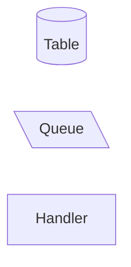
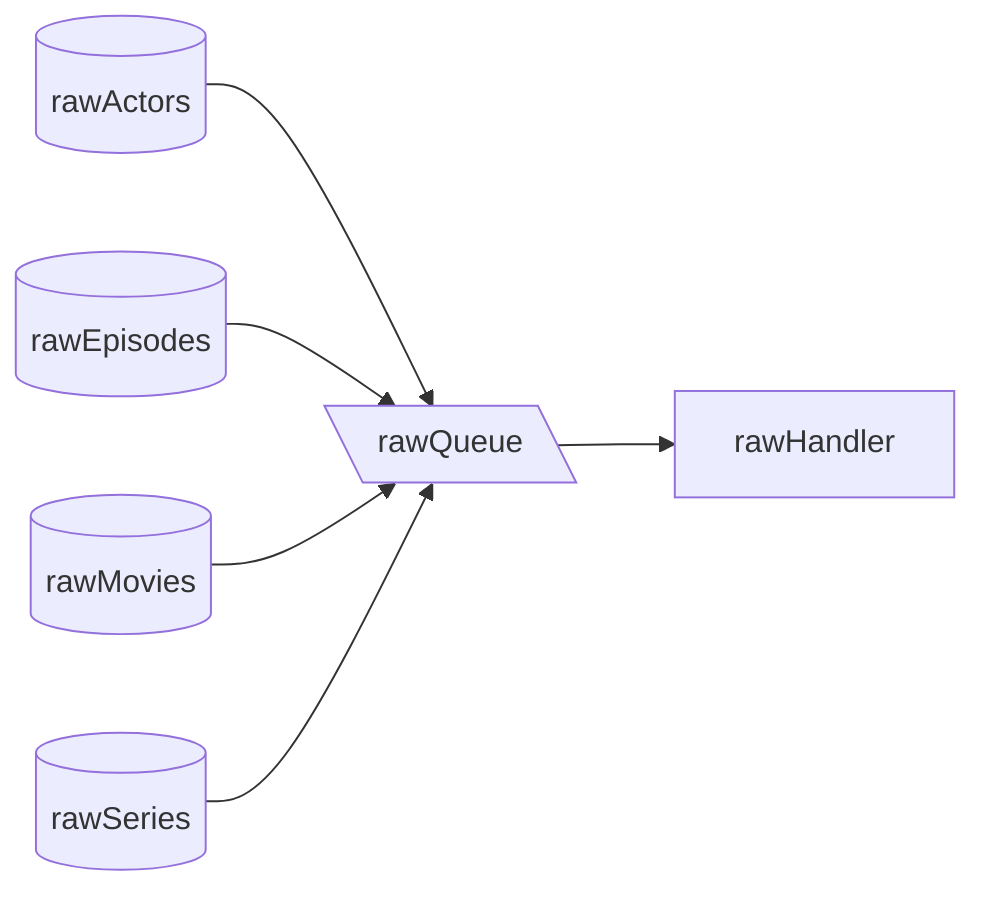
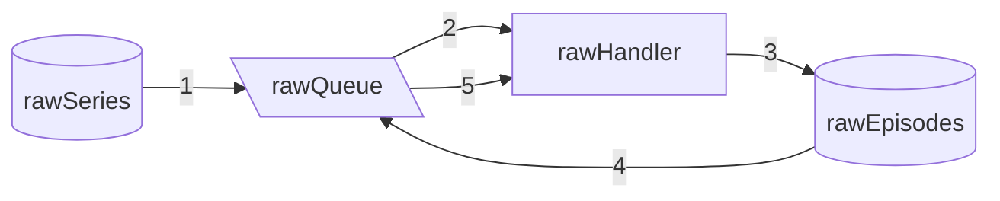
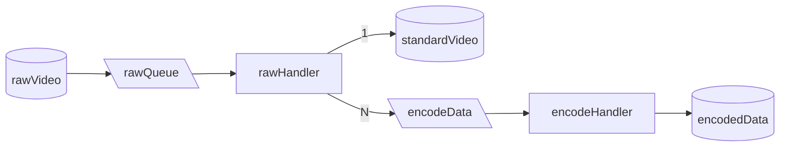
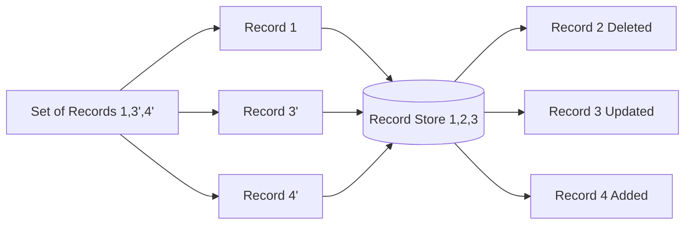

# Go Event System Demo

A demonstration of event-driven architecture patterns in Go, simulating a media processing pipeline.

## Overview

This project demonstrates various event system patterns through a media catalog system that processes actors, movies, and TV series data.

There are 3 main components in this project.
1. **Table** - An eventually consistent schema consistent set of data.
2. **Queue** - An event steam.
3. **Handler** - The function that processes events.

> A **Table** differs from a **Queue** in that when an event is received a **Table** can filter the event if no actual change is made or is received out of order. A **Queue** will always process all events.

These are show in mermaid diagrams through the following shapes


> **Handlers** should always receive from a **Queue** so in the event of processing error the data can be reprocessed. A **Table** would require an actual data change to reprocess.

## Scenarios Covered

### 1. Overloaded Queue

All raw data is dumped into a single queue. This contains multiple schemas of data for each event.

### 2. Recursive Breakdown

The same queue/handler is used to split an object and process its children.

> This is generally an anti-pattern but can occur if data vendor are inconsistent on how they provide data, requiring multiple levels of raw data to be stored to enable vendor syncing

### 3. Async Secondary Processes

A single input schema contains a subset of N many objects which are slow to process. These are split off so the fast data can be processed quickly

### 4. Fan Out Reconciliation Using Eventual Consistency

Given an input that contains the complete set, produce both updates and deletes to bring a consumer up to date. This is achieved through eventual consistency timestamp and setting all records before a given point as deleted.

## Running the Demo

```bash
# Start the server
go run main.go

# In another terminal, run the demo script
./demo.sh
```